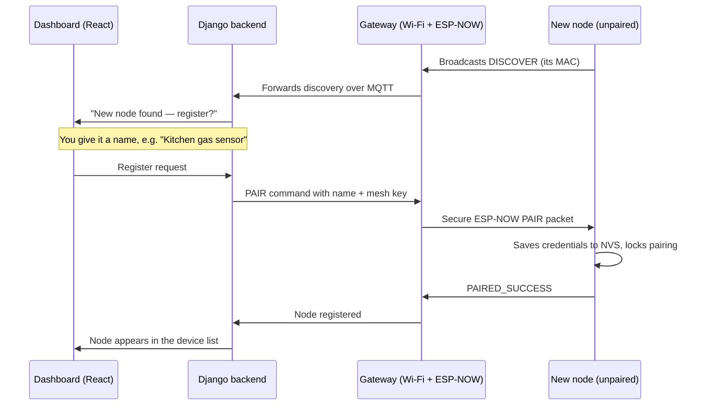

# Aether — Smart Energy Saver & Home Safety


An ESP32 mesh that meters the incoming mains, watches rooms for gas and fire, and
cuts power when something goes wrong — with a Django backend for history and a
React dashboard for control.

You configure Wi-Fi **once**, on a single gateway. Every other node is discovered,
named and paired from the dashboard, and never touches your Wi-Fi credentials.

## The part that matters

**A gas leak trips the relay even when the internet is down.**

The room sub-nodes do not depend on Wi-Fi, the broker, or the backend. When a
sub-node sees gas or flame it broadcasts a `TRIP_RELAY` packet straight to the
gateway over ESP-NOW, peer to peer, and the gateway opens the circuit. The cloud
path is for history, analytics and notifications — not for stopping a fire.

Everything else in this repo is built around keeping that path short.

## Contents

- [Architecture](#architecture)
- [Pairing a new node](#pairing-a-new-node)
- [Repository layout](#repository-layout)
- [Backend modules](#backend-modules)
- [API surface](#api-surface)
- [Dashboard](#dashboard)
- [Technology stack](#technology-stack)
- [Getting started](#getting-started)
- [Environment variables](#environment-variables)
- [Training the anomaly model](#training-the-anomaly-model)
- [What this repo does not do yet](#what-this-repo-does-not-do-yet)
- [Contributors](#contributors)

## Architecture

```text
  mains ──► Gateway ESP32 ──── Wi-Fi ───► HiveMQ Cloud ──► Django backend
            (relay + current          MQTT                 │  telemetry ingestion
             sensor, WiFiManager)                          │  hazard scoring
                 ▲                                         │  anomaly detection
                 │ ESP-NOW                                 │  recommendations
                 │ (no Wi-Fi, no cloud)                    │  web push
                 │                                         ▼
          Sub-Node ESP32s                             PostgreSQL / Supabase
          (MQ2 gas + flame)                                │
                 │                                         ▼
                 └── TRIP_RELAY on hazard ──► relay   React dashboard
                     works with the router off
```

Two firmware roles:

**Gateway** (`Firmware/Aether_Gateway`) — joins home Wi-Fi through a WiFiManager
captive portal, connects to HiveMQ Cloud over secure MQTT, drives the main relay,
monitors the current sensor with a local overcurrent trip, bridges all sub-node
telemetry to the broker, and handles discovery and pairing.

**Sub-node** (`Firmware/Aether_SubNode`) — one sketch for every room node. No
Wi-Fi. Reports over ESP-NOW, stores its mesh credentials in NVS once paired, and
broadcasts a discovery ping while unpaired.

## Pairing a new node



## Repository layout

```text
.
├── Backend/          Django 6 — telemetry, devices, hazards, anomaly, recommendations
├── Firmware/
│   ├── Aether_Gateway/   Wi-Fi + MQTT + ESP-NOW bridge, relay, current sensor
│   └── Aether_SubNode/   ESP-NOW only, gas + flame sensors
├── Frontend/         React 19 + TypeScript + Vite dashboard
├── ML/               IsolationForest training scripts and deployment notes
├── docker-compose.yml
└── implementation_plan.md
```

## Backend modules

| App | What it does |
| --- | --- |
| `telemetry` | MQTT subscriber (`mqtt.py`), reading ingestion, request middleware, history models |
| `devices` | Device registry, discovery queue, pairing and safety reset |
| `hazards` | Scores MQ2 gas and flame readings with explainable threshold logic, not a model |
| `anomaly` | `IsolationForest` over current, occupancy and hour-of-day to flag phantom draw |
| `recommendations` | pandas analysis of appliance history into plain-language saving actions |
| `notifications` | Web push delivery via `pywebpush` |
| `accounts` | Signup, login, logout, profile; JWT helpers in `jwt_utils.py` |
| `layout` | Room and floor plan data behind the digital twin |
| `core` | Settings, URL roots, ASGI and WSGI entry points |

`hazards` and `recommendations` each carry their own README with request and
response examples.

## API surface

```text
POST   /api/accounts/signup|login|logout/      GET /api/accounts/me/
GET    /api/telemetry/status/
GET    /api/telemetry/phantom-current/
GET    /api/telemetry/appliance-state/{status,history,current,insights,savings,power-usage}/
GET    /api/devices/unlinked/
POST   /api/devices/{register,unregister,reset-safety}/
POST   /api/hazards/predict/                   GET /api/hazards/thresholds/
GET    /api/recommendations/energy/?days=30    POST /api/recommendations/energy/
       /api/anomaly/   /api/layout/   /api/notifications/   /api/socket-status/
```

## Dashboard

`Frontend/src/components` holds the views: **Dashboard**, **Analytics**,
**Automation**, **Digital Twin**, **Events**, **Manual Control**, **Safety Hub**,
**Settings**, and a **Safety Alert Overlay** that takes over the screen on a
hazard.

## Technology stack

| Layer | Tools |
| --- | --- |
| Firmware | ESP32, Arduino IDE, ESP-NOW, WiFiManager, NVS |
| Transport | MQTT over TLS via HiveMQ Cloud (`paho-mqtt`) |
| Backend | Django 6.0.5, Gunicorn, `dj-database-url`, `psycopg2-binary` |
| Data | PostgreSQL / Supabase, SQLite for local development |
| ML | scikit-learn, pandas, NumPy, joblib |
| Notifications | `pywebpush` |
| Frontend | React 19, TypeScript 5.8, Vite 6, Tailwind CSS 4, Motion, Recharts, Three.js, lucide-react |

The backend uses plain Django views rather than Django REST Framework.

## Getting started

### Prerequisites

- Python 3.12+
- Node.js 18+
- An MQTT broker — HiveMQ Cloud works out of the box
- PostgreSQL or a Supabase project, optional for local runs

### Backend

```bash
cd Backend
python -m venv venv
venv\Scripts\activate          # source venv/bin/activate on macOS/Linux
pip install -r requirements.txt
cp .env.example .env           # then fill it in
python manage.py migrate
python manage.py runserver
```

### Frontend

```bash
cd Frontend
npm install
cp .env.example .env
npm run dev                    # http://localhost:3000
```

| Command | Purpose |
| --- | --- |
| `npm run dev` | Vite dev server on port 3000, bound to `0.0.0.0` |
| `npm run build` | Production build |
| `npm run preview` | Serve the production build |
| `npm run lint` | `tsc --noEmit` |
| `npm run clean` | Remove `dist/` |

### Firmware

Open `Firmware/Aether_Gateway/Aether_Gateway.ino` in the Arduino IDE. Copy
`secrets.example.h` to `secrets.h` and fill in your broker credentials —
`secrets.h` is gitignored and must never be committed. Flash the gateway first,
join it to Wi-Fi through the captive portal, then flash
`Aether_SubNode/Aether_SubNode.ino` to every room node and pair them from the
dashboard.

## Environment variables

**`Backend/.env`**

```env
DJANGO_SECRET_KEY=
DEBUG=
ALLOWED_HOSTS=
DATABASE_URL=
DATABASE_CONN_MAX_AGE=
MQTT_BROKER=
MQTT_PORT=
MQTT_TOPIC=
MQTT_USER=
MQTT_PASSWORD=
```

**`Frontend/.env`**

```env
VITE_API_URL=
APP_URL=
GEMINI_API_KEY=
```

## Training the anomaly model

The phantom-current detector is an `IsolationForest` over three features:
`current`, `pir` occupancy, and `hour_of_day`.

```bash
python Backend/manage.py train_anomaly_model --minutes 30 --min-rows 500
```

Or train from a custom table through `DATABASE_URL`:

```bash
python ML/scripts/train_phantom_current_model.py --table sensor_history --min-rows 500
```

The artifact is written to `Backend/anomaly/models/phantom_current_iforest.joblib`,
which is gitignored. See `ML/README.md` and `ML/DEPLOYMENT.md` for the bootstrap
path when there isn't enough telemetry yet.

## What this repo does not do yet

Written down so nobody rediscovers one of these during a demo.

- **`docker-compose.yml` only builds the frontend**, on port 8080. The backend,
  broker and database are not in it — run the backend yourself.
- **`Backend/requirements.txt` is UTF-16 encoded**, which some `pip` versions
  refuse. Convert it to UTF-8 if `pip install -r` fails.
- **No automated tests of substance.** `tests.py` exists in `layout`,
  `recommendations` and `telemetry`, and there is no CI.
- The hazard scoring is threshold logic, not a trained model. It is explainable
  and fast, which is the point, but it is not learned from data.

## Contributors

Built by [@Ankan0503](https://github.com/Ankan0503) and
[@Sayan260106](https://github.com/Sayan260106).
