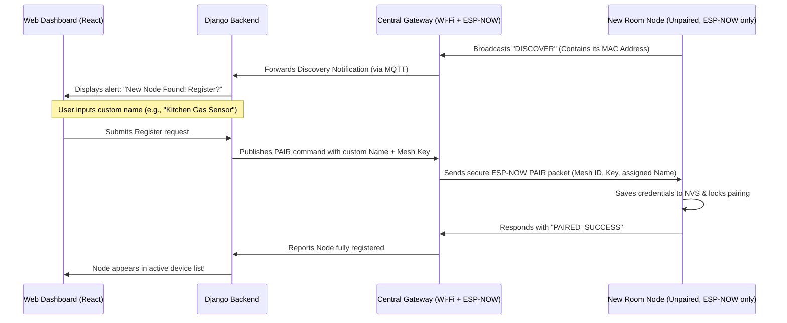

# Gateway-Coordinator ESP-NOW Mesh with Auto-Discovery

We are upgrading the mesh architecture to a **Centralized Gateway Model**. Under this system, the user **only configures Wi-Fi once on a single "Central Gateway" ESP32**. All other room sensor nodes are automatically discovered, paired, named, and managed directly from the **Aether Web Dashboard**.

---

## The Auto-Discovery & Pairing Protocol

---

## Core System Architecture

### 1. The Central Gateway Node (Wi-Fi + MQTT + Relay/Current Control)
* Connects to your home Wi-Fi (using the `WiFiManager` captive portal) and HiveMQ Cloud secure MQTT.
* **Physical Hardware:** Controls the Main Relay and monitors the Current Sensor.
* Acts as a **bridge and controller**:
  1. Manages its own physical relay and current safety logic (local overcurrent trips).
  2. Listens for "TRIP" packets from the Sensor Node via ESP-NOW to instantly trip its local relay.
  3. Forwards all telemetry (its own + the wireless Sensor Node's) to HiveMQ/Django.
  4. Listens for "DISCOVER" signals and manages provisioning.

### 2. The Room Sub-Nodes (Unpaired, ESP-NOW only)
* **Physical Hardware:** Connected to the Gas Sensor and Flame Sensor (e.g. in the Kitchen).
* Does **not** connect to Wi-Fi. Uses ESP-NOW to send status reports to the Gateway.
* In an emergency (Gas Leak or Fire), it broadcasts a high-priority, secure **"TRIP_RELAY"** message to the Gateway via ESP-NOW.
* When unpaired, broadcasts a discovery ping so the user can link it on the dashboard.

---

## Proposed Changes

### Django Backend & DB Updates
* **Model Updates:** Modify the telemetry/device database models to associate readings with specific device names/MAC addresses.
* **MQTT Handler:** Update [mqtt.py](file:///c:/Projects/Smart-Energy-Saver-and-Home-Safety/Backend/telemetry/mqtt.py) to parse device discovery notifications and handle pairing actions.
* **API Endpoints:** Expose endpoints for `/api/devices/unlinked/` and `/api/devices/register/`.

### React Web Frontend Updates
* **Device Management Panel:** Build a UI in [SettingsView.tsx](file:///c:/Projects/Smart-Energy-Saver-and-Home-Safety/Frontend/src/components/SettingsView.tsx) to:
  * View active devices in the mesh.
  * Display a pop-up alert when a new unassigned ESP32 is discovered.
  * Input a friendly name (e.g. "Bedroom Outlet") to provision the device.

### ESP32 Firmware Codes
* **[NEW] `Aether_Gateway.ino`:** Code for the Central Gateway Node (WiFiManager + MQTT + ESP-NOW Bridge).
* **[NEW] `Aether_SubNode.ino`:** Universal code for all other nodes (Sensors, Relays). The role (e.g., sensor vs relay) can be selected in the pairing menu or auto-detected by connected hardware pins.

---

## Verification Plan

### Manual Verification
1. **Initial Provisioning:** Connect Gateway to Wi-Fi. Verify it connects to HiveMQ.
2. **Discovery Verification:** Power on a new unprovisioned Sub-Node. Verify that the React Web Dashboard flashes a message: *"New device discovered"*.
3. **Pairing Verification:** Assign a name to the new device on the dashboard. Verify that the Sub-Node stops flashing its setup LED, saves the mesh key, and begins sending secure telemetry.
4. **Relay Cut-off (Internet Offline):** Power off the home Wi-Fi router. Trigger a gas alert on the Sensor Sub-Node. Verify that the Relay Sub-Node trips the power circuit immediately using local peer-to-peer ESP-NOW.
